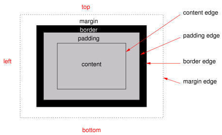
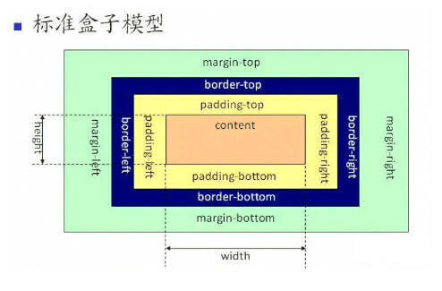
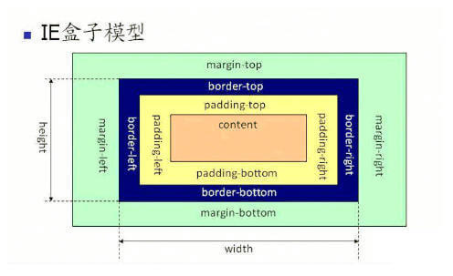

盒模型的四要素是border、margin、padding、content

盒模型基本概念
所有HTML元素，在页面的呈现过程中，都遵循CSS制定的盒模型。盒模型的几个要素是 border 、 margin 、 padding 、 content ，如下图，



盒模型
* content：真正包含元素内容的区域
* padding(内边距)：内容和边框之间的一段间距，属于标签内部
* border(边框)：包含边框的区域，扩展了内边距区域。它位于边框边界内部。大小为border-box宽和border-box高
* margin(外边距)：该标签和其他标签之间的间距，设置此内容，不会影响标签的大小

当一个元素既有margin,又有padding,还有边框时，在普通流中所占的空间就是这些值的总和。

即横向空间为：marginLeft + borderLeftWidth + paddingLeft + width + paddingRight + borderRightWidth + marginRight，纵向的同理。


盒模型的分类及不同盒模型之间的区别
盒模型分为***IE盒模型***和***W3C标准***的盒模型。
> 它们之间的区别在于IE盒模型和W3C标准盒模型计算高度和宽度的方式不同。具体不同表现在以下方面：

W3C标准盒模型（高度的计算类似）：

一个元素的宽度= content 

盒子的总宽度= margin-left + border-left + padding-left + width + padding-right + border-right + margin-right 




IE怪异盒模型（高度的计算类似）：

一个元素的宽度= content + padding + border 
盒子的总宽度= margin-left + width + margin-right 



如何通过CSS设置IE盒模型和W3C标准盒模型
```css
 //W3C标准盒模型（浏览器默认）
 box-sizing:content-box;
 
 //IE怪异盒模型
 box-sizing:border-box;
 
 ```
<br>


 box-sizing 是CSS3的新属性，为了避免在不同的浏览器中表现不同的情况产生，我们可以这样使用
 ```css
    Element {
        -moz-box-sizing: border-box;  
        -webkit-box-sizing: border-box; 
        -o-box-sizing: border-box; 
        -ms-box-sizing: border-box; 
        box-sizing: border-box; 
    }
```
<br>
用盒模型解释边距重叠
边距重叠也称为外边距合并，指的是块的顶部外边距和底部外边距有时被组合（折叠）为单个外边距，其大小时组合到其中的最大的外边距。
发生边距重叠的基本情况有三种：

* 1、相邻的兄弟姐妹元素
* 2、块级元素与其第一个或最后一个子元素
* 3、空块元素

## 阻止合并方法
这部分将讲解不会发生外边距合并的情况

 > 1.通用方法

* 处于静态流元素会发生合并，所以 float 和 position:absolute 都不会发生合并
设置为 inline-block ，也不会发生合并

> 2.针对于父元素和子元素情况不合并方法
以下都不会发生合并
* 设置了清除浮动属性
因为 margin 需要直接接触才能合并，所以父元素或子元素中有 border 或 padding ，或者二者之间有元素