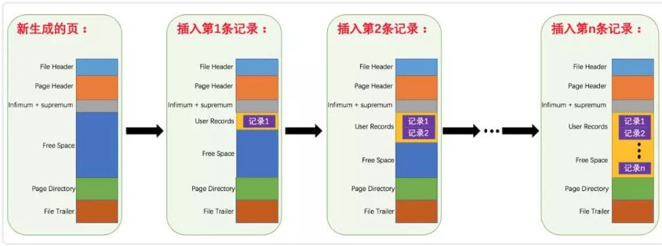
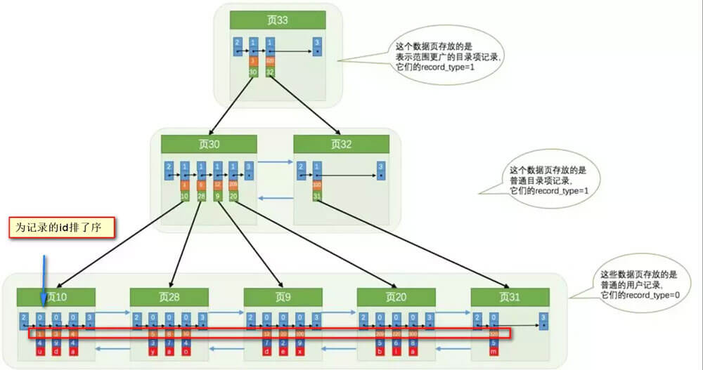
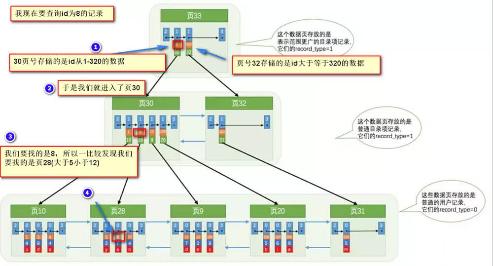

> 事务相关以及索引查询

## 一、事务相关
事务是逻辑上的一组操作，要么都执行，要么都不执行。
假如：小明要给小红转账1000元，这个转账会涉及到两个关键操作就是：将小明的余额减少1000元，将小红的余额增加1000元。万一在这两个操作之间突然出现错误比如银行系统崩溃，导致小明余额减少而小红的余额没有增加，这样就不对了。事务就是保证这两个关键操作要么都成功，要么都要失败。

## 事物的四大特性(ACID)
<ul><li>
原子性： 事务是最小的执行单位，不允许分割。事务的原子性确保动作要么全部完成，要么完全不起作用；</li><li>
一致性： 执行事务前后，数据保持一致，多个事务对同一个数据读取的结果是相同的；</li><li>
隔离性： 并发访问数据库时，一个用户的事务不被其他事务所干扰，各并发事务之间数据库是独立的；</li><li>
持久性： 一个事务被提交之后。它对数据库中数据的改变是持久的，即使数据库发生故障也不应该对其有任何影响。</li><li>

</li></ul>## 并发事务带来哪些问题？
在典型的应用程序中，多个事务并发运行，经常会操作相同的数据来完成各自的任务（多个用户对统一数据进行操作）。并发虽然是必须的，但可能会导致以下的问题：

<ul><li>
脏读（Dirty read）: 当一个事务正在访问数据并且对数据进行了修改，而这种修改还没有提交到数据库中，这时另外一个事务也访问了这个数据，然后使用了这个数据。因为这个数据是还没有提交的数据，那么另外一个事务读到的这个数据是“脏数据”，依据“脏数据”所做的操作可能是不正确的。</li><li>

</li><li>
丢失修改（Lost to modify）: 指在一个事务读取一个数据时，另外一个事务也访问了该数据，那么在第一个事务中修改了这个数据后，第二个事务也修改了这个数据。这样第一个事务内的修改结果就被丢失，因此称为丢失修改。例如：事务1读取某表中的数据A=20，事务2也读取A=20，事务1修改A=A-1，事务2也修改A=A-1，最终结果A=19，事务1的修改被丢失。</li><li>

</li><li>
不可重复读（Unrepeatableread）: 指在一个事务内多次读同一数据。在这个事务还没有结束时，另一个事务也访问该数据。那么，在第一个事务中的两次读数据之间，由于第二个事务的修改导致第一个事务两次读取的数据可能不太一样。这就发生了在一个事务内两次读到的数据是不一样的情况，因此称为不可重复读。</li><li>

</li><li>
幻读（Phantom read）: 幻读与不可重复读类似。它发生在一个事务（T1）读取了几行数据，接着另一个并发事务（T2）插入了一些数据时。在随后的查询中，第一个事务（T1）就会发现多了一些原本不存在的记录，就好像发生了幻觉一样，所以称为幻读。</li><li>

</li></ul>
不可重复度和幻读区别：
不可重复读的重点是修改，幻读的重点在于新增或者删除。

例1（同样的条件, 你读取过的数据, 再次读取出来发现值不一样了 ）：事务1中的A先生读取自己的工资为 1000的操作还没完成，事务2中的B先生就修改了A的工资为2000，导 致A再读自己的工资时工资变为 2000；这就是不可重复读。

例2（同样的条件, 第1次和第2次读出来的记录数不一样 ）：假某工资单表中工资大于3000的有4人，事务1读取了所有工资大于3000的人，共查到4条记录，这时事务2 又插入了一条工资大于3000的记录，事务1再次读取时查到的记录就变为了5条，这样就导致了幻读。

## 事务隔离级别有哪些?MySQL的默认隔离级别是？

SQL 标准定义了四个隔离级别：

<ul><li>
READ-UNCOMMITTED(读取未提交)： 最低的隔离级别，允许读取尚未提交的数据变更，可能会导致脏读、幻读或不可重复读。</li><li>
READ-COMMITTED(读取已提交)： 允许读取并发事务已经提交的数据，可以阻止脏读，但是幻读或不可重复读仍有可能发生。</li><li>
REPEATABLE-READ(可重复读)： 对同一字段的多次读取结果都是一致的，除非数据是被本身事务自己所修改，可以阻止脏读和不可重复读，但幻读仍有可能发生。</li><li>
SERIALIZABLE(可串行化)： 最高的隔离级别，完全服从ACID的隔离级别。所有的事务依次逐个执行，这样事务之间就完全不可能产生干扰，也就是说，该级别可以防止脏读、不可重复读以及幻读。</li></ul>

<table width="556"><thead><tr><th align="center">隔离级别</th><th align="center">脏读</th><th align="center">不可重复读</th><th align="center">幻影读</th></tr></thead><tbody><tr><td align="center">READ-UNCOMMITTED</td><td align="center">√</td><td align="center">√</td><td align="center">√</td></tr><tr><td align="center">READ-COMMITTED</td><td align="center">×</td><td align="center">√</td><td align="center">√</td></tr><tr><td align="center">REPEATABLE-READ</td><td align="center">×</td><td align="center">×</td><td align="center">√</td></tr><tr><td align="center">SERIALIZABLE</td><td align="center">×</td><td align="center">×</td><td align="center">×</td></tr></tbody></table>

MySQL InnoDB 存储引擎的默认支持的隔离级别是 REPEATABLE-READ（可重读）。我们可以通过<code>SELECT @@tx_isolation;</code>命令来查看

mysql&gt; SELECT @@tx_isolation;
+-----------------+
| @@tx_isolation  |
+-----------------+
| REPEATABLE-READ |
+-----------------+

注意：与 SQL 标准不同的地方在于InnoDB 存储引擎在 REPEATABLE-READ（可重读）事务隔离级别下使用的是Next-Key Lock 锁算法，因此可以避免幻读的产生，这与其他数据库系统(如 SQL Server)是不同的。所以说InnoDB 存储引擎的默认支持的隔离级别是 REPEATABLE-READ（可重读） 已经可以完全保证事务的隔离性要求，即达到了 SQL标准的SERIALIZABLE(可串行化)隔离级别。

因为隔离级别越低，事务请求的锁越少，所以大部分数据库系统的隔离级别都是READ-COMMITTED(读取提交内容):，但是你要知道的是InnoDB 存储引擎默认使用 REPEATABLE-READ（可重读）并不会有任何性能损失。

InnoDB 存储引擎在 分布式事务 的情况下一般会用到SERIALIZABLE(可串行化)隔离级别。

## 二、索引相关

## 为什么索引能提高查询速度

先从 MySQL 的基本存储结构说起
<a href="https://www.webq.top/article/914" target="_blank">MySQL的基本存储结构是页 (记录都存在页里边) ：</a>

<ul><li>
各个数据页可以组成一个双向链表</li><li>
每个数据页中的记录又可以组成一个单向链表</li></ul>

<pre><code>- 每个数据页都会为存储在它里边儿的记录生成一个页目录，在通过主键查找某条记录的时候可以在页目录中使用二分法快速定位到对应的槽，\n    然后再遍历该槽对应分组中的记录即可快速找到指定的记录
- 以其他列(非主键)作为搜索条件：只能从最小记录开始依次遍历单链表中的每条记录。</code></pre>

所以说，如果我们写select * from user where indexname = 'xxx'这样没有进行任何优化的sql语句，默认会这样做：

<ol><li>
定位到记录所在的页：需要遍历双向链表，找到所在的页</li><li>
从所在的页内中查找相应的记录：由于不是根据主键查询，只能遍历所在页的单链表了</li></ol>

很明显，在数据量很大的情况下这样查找会很慢！这样的时间复杂度为O（n）。

索引做了些什么可以让我们查询加快速度呢？其实就是将无序的数据变成有序(相对)：

要找到id为8的记录简要步骤：

很明显的是：没有用索引我们是需要遍历双向链表来定位对应的页，现在通过 “目录” 就可以很快地定位到对应的页上了！（二分查找，时间复杂度近似为O(logn)）

其实底层结构就是B+树，B+树作为树的一种实现，能够让我们很快地查找出对应的记录。

