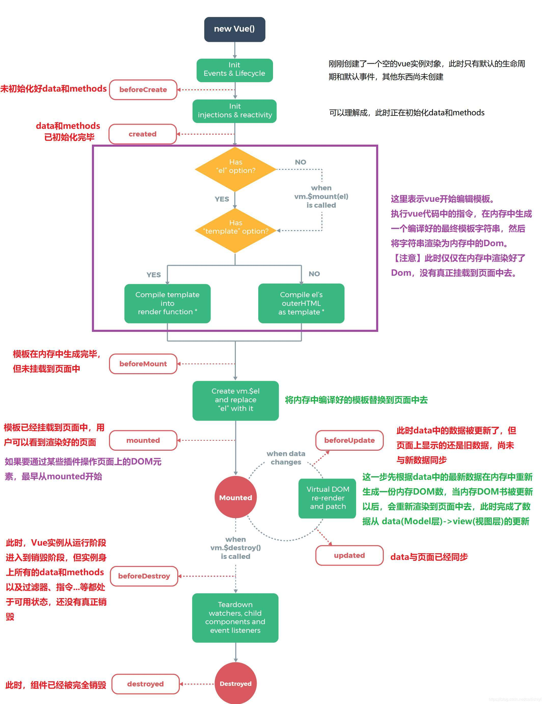

从组件被创建，到组件挂载到页面上运行，再到页面关闭组件被卸载，这三个阶段总是伴随着组件各种各样的事件，那么这些事件，统称为组件的生命周期函数！

* beforecreated
> el 和 data 并未初始化 
* created
> 完成了 data 数据的初始化，el没有
* beforeMount
> 完成了 el 和 data 初始化
* mounted
> 完成挂载

另外在标红处，我们能发现el还是 {{message}}，这里就是应用的  Virtual DOM （虚拟Dom）技术，先把坑占住了。到后面 mounted 挂载的时候再把值渲染进去。


* update 相关
这里我们在 chrome console里执行以下命令
```javascript
 app.message= 'yes !! I do'; 
 ```
下面就能看到data里的值被修改后，将会触发update的操作。

* *destroy相关
有关于销毁，暂时还不是很清楚。我们在console里执行下命令对 vue实例进行销毁。销毁完成后，我们再重新改变message的值，vue不再对此动作进行响应了。但是原先生成的dom元素还存在，可以这么理解，执行了destroy操作，后续就不再受vue控制了。因为这个Vue实例已经不存在了。

app.$destroy();

生命周期总结

beforecreate : 举个栗子：可以在这加个loading事件

created ：在这结束loading，还做一些初始化，实现函数自执行

mounted ： 在这发起后端请求，拿回数据，配合路由钩子做一些事情

beforeDestory： 你确认删除XX吗？ destoryed ：当前组件已被删除，清空相关内容

```html
 <!DOCTYPE html>
 <html>
     <head>
         <title></title>
     <script type="text/javascript" 
         src="https://cdn.jsdelivr.net/vue/2.1.3/vue.js"></script>
 </head>
 <body>
     
     <div id="app">
          <p>{{ message }}</p>
 </div>
 
 <script type="text/javascript">
     
   var app = new Vue({
           el: '#app',
       data: {
               message : "xuxiao is boy" 
       },
        beforeCreate: function () {
                     console.group('beforeCreate 创建前状态===============》');
                console.log("%c%s", "color:red" , "el     : " + this.$el); //undefined
                console.log("%c%s", "color:red","data   : " + this.$data); //undefined 
                console.log("%c%s", "color:red","message: " + this.message)  
         },
         created: function () {
                 console.group('created 创建完毕状态===============》');
             console.log("%c%s", "color:red","el     : " + this.$el); //undefined
                console.log("%c%s", "color:red","data   : " + this.$data); //已被初始化 
                console.log("%c%s", "color:red","message: " + this.message); //已被初始化
         },
         beforeMount: function () {
                 console.group('beforeMount 挂载前状态===============》');
             console.log("%c%s", "color:red","el     : " + (this.$el)); //已被初始化
             console.log(this.$el);
                console.log("%c%s", "color:red","data   : " + this.$data); //已被初始化  
                console.log("%c%s", "color:red","message: " + this.message); //已被初始化  
         },
         mounted: function () {
                 console.group('mounted 挂载结束状态===============》');
             console.log("%c%s", "color:red","el     : " + this.$el); //已被初始化
             console.log(this.$el);    
                console.log("%c%s", "color:red","data   : " + this.$data); //已被初始化
                console.log("%c%s", "color:red","message: " + this.message); //已被初始化 
         },
         beforeUpdate: function () {
                 console.group('beforeUpdate 更新前状态===============》');
             console.log("%c%s", "color:red","el     : " + this.$el);
             console.log(this.$el);   
                console.log("%c%s", "color:red","data   : " + this.$data); 
                console.log("%c%s", "color:red","message: " + this.message); 
         },
         updated: function () {
                 console.group('updated 更新完成状态===============》');
             console.log("%c%s", "color:red","el     : " + this.$el);
             console.log(this.$el); 
                console.log("%c%s", "color:red","data   : " + this.$data); 
                console.log("%c%s", "color:red","message: " + this.message); 
         },
         beforeDestroy: function () {
                 console.group('beforeDestroy 销毁前状态===============》');
             console.log("%c%s", "color:red","el     : " + this.$el);
             console.log(this.$el);    
                console.log("%c%s", "color:red","data   : " + this.$data); 
                console.log("%c%s", "color:red","message: " + this.message); 
         },
         destroyed: function () {
                 console.group('destroyed 销毁完成状态===============》');
             console.log("%c%s", "color:red","el     : " + this.$el);
             console.log(this.$el);  
                console.log("%c%s", "color:red","data   : " + this.$data); 
                console.log("%c%s", "color:red","message: " + this.message)
         }
     })
 </script>
 </body>
 </html>
 ```
## 根据下图：vue的生命周期可以用如下一个类来表示
 
``` javascript
interface DataInterface {
    [key: string]: any;
}

interface ConfigInterface {
    el: string;
    data: DataInterface;
    beforeCreate?: Function;
    created?: Function;
    beforeMount?: Function;
    mounted?: Function;
    beforeUpdate?: Function;
    updated?: Function;
    beforeDestroy?: Function;
    destroyed?: Function;
    templete?: string;
}

class Vue {
        config: ConfigInterface;
    $el: HTMLElement;
    $data: DataInterface;

    constructor(config: ConfigInterface) {
            this.config = {
                el: '#app',
            beforeCreate: () => {},
            created: () => {},
            beforeMount: () => {},
            mounted: () => {},
            beforeUpdate: () => {},
            updated: () => {},
            beforeDestroy: () => {},
            destroyed: () => {},
            ...config,
        };
        this.config.beforeCreate();  // 初始化之前
        this.init();
    }

    private init() {
            <span style="color: rgb(249, 150, 59);">// 执行初始化相关操作
        this.$data = this.config.data; <span style="color: rgb(249, 150, 59);">// 生成$data

        this.config.created();
        if (this.config.el) {
                this.hasTemplete();
        } else {
                <span style="color: rgb(249, 150, 59);">// 等待外部调用vm.$mount(el)
            // 再执行---> this.hasTemplete();
        }
    }

    private hasTemplete() {
            if (this.config.templete) {
                // 用传入的值渲染容器
        } else {
                // 用el的outHTML渲染容器
        }
        this.$el = ...; // 生成$el
        this.config.beforeMount();
        <span style="color: rgb(249, 150, 59);">// 向this.$el挂载数据
        this.config.mounted(); 
<h2>        <span style="color: rgb(249, 150, 59);">// 初始化结束</h2>    }
    <span style="color: rgb(249, 150, 59);">// 当数据更新时调用此方法
    private dataUpdate() { 
            // 数据更新时调用，发生在虚拟 DOM 重新渲染和打补丁之前。
        // 可以在这个钩子中进一步地更改状态，这不会触发附加的重渲染过程。
        this.config.beforeUpdate(); 
        // 渲染数据到页面
        this.config.updated(); 
    }
    <span style="color: rgb(249, 150, 59);">// 销毁
    destroy() {
            this.config.beforeDestroy();
        // 销毁一些监听函数 组件之类的
        this.config.destroyed(); 
    }
}

export default Vue; 

```

