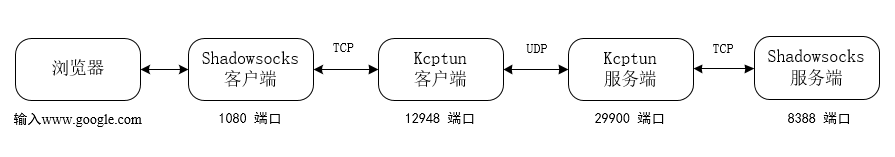
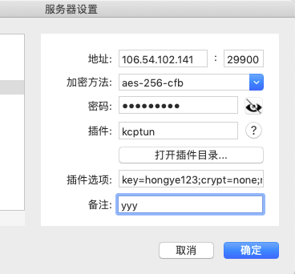

> Kcptun 是一个非常简单和快速的，基于 KCP 协议的 UDP 隧道，它可以将 TCP 流转换为 KCP+UDP 流。而 KCP 是一个快速可靠协议，能以比 TCP 浪费100%-200%的带宽的代价（理想状态下），换取平均延迟降低 30%-40%，且最大延迟降低三倍的传输效果。


<a href="https://www.bilibili.com/blackboard/diagnostics.html" target="_blank">网络诊断地址</a>


工作原理：



## 服务端安装 KCPTun

``` bash

wget --no-check-certificate https://github.com/kuoruan/shell-scripts/raw/master/kcptun/kcptun.sh && chmod +x ./kcptun.sh && ./kcptun.sh
```

接下来会依次提醒设置以下参数（这里是最终的结果
* 1、端口：默认29900，即为KCPTUN与其客户端连接使用的端口，默认即可。
* 2、要加速的地址：默认127.0.0.1。
* 3、要加速的端口：设置为你的SS/SSR使用的端口。
* 4、密码：自己设置，用于KCPTUN客户端连接使用，不要使用默认密码。
* 5、加密方式选择：较强的加密方式会影响网速，建议默认aes或不加密。
* 6、加速模式：推荐fast2即可。随后可以手动修改为其它模式，测试加速效果。
* 7、MTU：默认1350即可。
* 8、sndwnd：发送窗口大小，与服务器的上传带宽大小有关，这项与rcvwnd的比例会影响加速效果，可以暂时设置为默认的512。
* 9、rcvwnd：接收窗口大小，与服务器的下载带宽大小有关，也可以暂设置为默认的512，或者1024也可以。
* 10、以下几项中，除了数据压缩外，其它保持默认参数即可。建议关闭数据压缩，可以在一定程度上提升传输效率。
* 11、其余各项设置，保持默认即可，设置完成后，按任意键开始安装过程

``` bash

{
  "localaddr": ":17926", // 服务器ssr的端口
  "remoteaddr": "106.54.102.141:29900", // 加速地址以及 kcptun 使用的端口
  "key": "hongye123", //  kcptun 的密码
  "crypt": "none", // 加密方式
  "mode": "fast2", // 
  "mtu": 1350, // 
  "sndwnd": 512, // 
  "rcvwnd": 512, // 
  "datashard": 10, // 
  "parityshard": 3, // 
  "dscp": 0, // 
  "nocomp": true, // 
  "quiet": false, // 
  "tcp": false // 
}
```
## 下面的参数配置将是之后在客户端中填写的重要参数

``` bash
key=hongye123;crypt=none;mode=fast2;mtu=1350;sndwnd=512;rcvwnd=512;datashard=10;parityshard=3;dscp=0;nocomp
```

* KCPTUN安装目录：/usr/local/kcptun
* KCPTUN的参数配置文件：/usr/local/kcptun/server-config.json
* 启动：supervisorctl start kcptun
* 停止：supervisorctl stop kcptun
* 重启：supervisorctl restart kcptun
* 状态：supervisorctl status kcptun
* 卸载：./kcptun.sh uninstall

## 客户端配置（这里只介绍mac
<a href="https://github.com/shadowsocks/ShadowsocksX-NG/releases" target="_blank">点击下载最新的ShadowsocksX-NG</a>（我这里下载的是1.9.2版本
具体配置如下：


注： 端口号要填写kcptun的端口号，参数选项即为上述，服务端安装好之后返回的一串数据


Windows：<a href="https://github.com/xtaci/kcptun/releases" target="_blank" rel="noopener">https://github.com/xtaci/kcptun/releases</a>

iOS：没有对应的客户端，可以在路由器上安装，间接使用kcptun加速
Android：<a href="https://github.com/shadowsocks/kcptun-android/releases" target="_blank" rel="noopener">https://github.com/shadowsocks/kcptun-android/releases</a>


<a href="https://ssr.tools/588" target="_blank">详细讲解看这</a>


