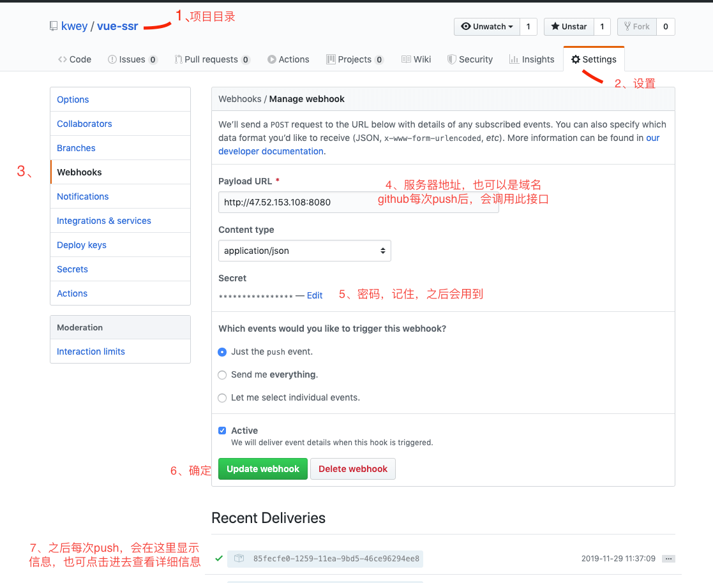

## 一、先说明下最终要实现的效果
* 1、服务器监听 GitHub，push代码后，拉取最新代码
* 2、安装依赖，打包代码
* 3、把打包的文件（dist/*）移动到发布目录，并命名（next
* 4、把正在运行的目录（dist）重命名（pre），（next）重命名（dist）
* 5、重启服务
## 二、GitHub的webhooks


## 三、创建 webhook 服务后端

webhook.js
``` javascript
<span style="font-family: &quot;Source Sans Pro&quot;, &quot;Helvetica Neue&quot;, Arial, sans-serif;">const http = require("http");</span>
const createHandler = require("github-webhook-handler");
const handler = createHandler({ path: "/", secret: "hongye" });
// 上面的 secret 保持和 GitHub 后台设置的一致

handler.on("error", function(err) {
      console.error("Error:", err.message);
});

handler.on("push", function(event) {
      const name = event.payload.repository.name;
  console.log("Received a push event for %s to %s", name, event.payload.ref);
  switch (name) {
        case "vue-ssr":
      runCmd("sh", ["./deploy.sh", name], function(text) {
            console.log(text);
      });
      break;
    default:
      break;
  }
});

function runCmd(cmd, args, callback) {
      const spawn = require("child_process").spawn;
  const child = spawn(cmd, args);
  let resp = "";
  child.stdout.on("data", function(buffer) {
        resp += buffer.toString();
  });
  child.stdout.on("end", function() {
        callback(resp);
  });
}

http
  .createServer(function(req, res) {
        handler(req, res, function() {
          res.statusCode = 404;
      res.end("no such location");
    });
  })
  .listen(8080);
  
  ```
packages.json
``` javascript
function imgLoad(url) {{
    "name": "hongye",
    "version": "1.0.0",
    "description": "",
    "main": "webhook.js",
    "scripts": {
            "deploy": "pm2 start webhook.js",
        "red": "pm2 restart webhook.js",
        "start": "pm2 start ./server", //vue-项目启动程序
        "re": "pm2 restart ./server"  // vue-项目重启
    },
    "author": "",
    "license": "ISC",
    "dependencies": {
            "axios": "^0.19.0",
        "tslib": "^1.10.0",
        "typescript": "^3.7.2",
        "koa": "^2.11.0",
        "koa-static": "^5.0.0",
        "koa-send": "^5.0.0",
        "vue": "^2.6.10",
        "vue-class-component": "^7.0.2",
        "vue-property-decorator": "^8.3.0",
        "vue-router": "^3.1.3",
        "vuex": "^3.0.1",
        "vue-server-renderer": "^2.6.10",
        "vue-lazyload": "^1.3.3",
        "github-webhook-handler": "^0.7.1"
    }
}

```
deploy.sh

``` javascipt

#!/bin/bash
# 网站的根目录
WEB_PATH='/var/www/vue-ssr'
DEP_PATH='/var/www/deploy'
 
cd $WEB_PATH
echo "fetching from remote..."
# 为了避免冲突，强制更新本地文件
git fetch --all
git reset --hard origin/master
npm i
npm run build:mac

mkdir -p $DEP_PATH/next
mv ./dist/* $DEP_PATH/next

cd $DEP_PATH
rm -rf ./pre
mv -f ./dist ./pre
mv -f ./next ./dist
rm -rf ./next/*

npm run re

echo "done"


```


